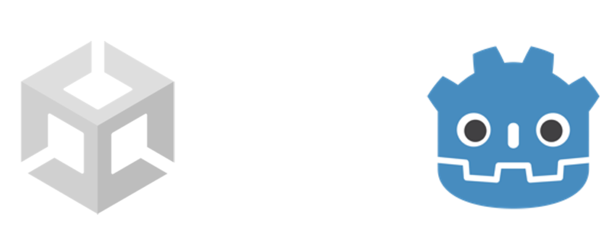
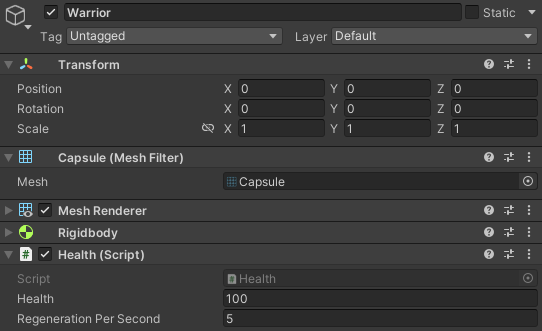
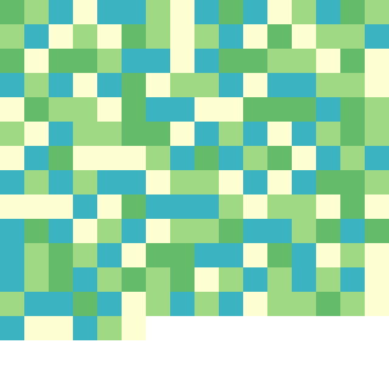
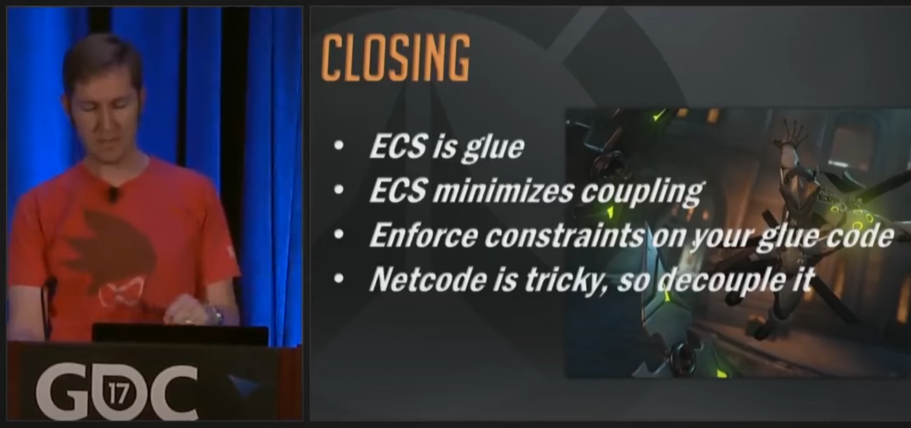
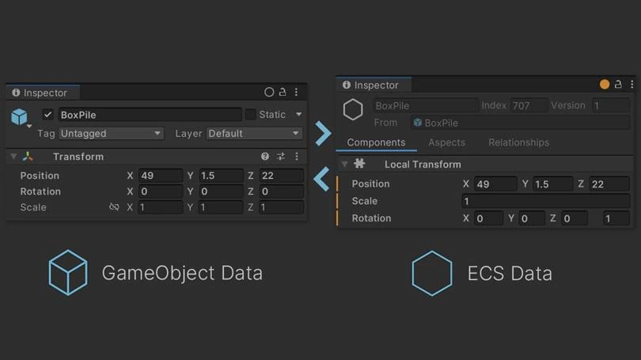
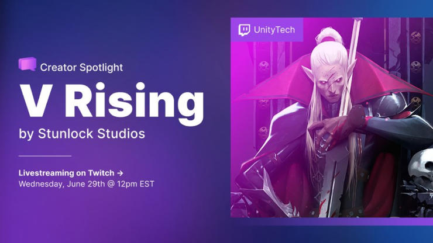

# Arquitectura ECS

Una manera alternativa de hacer videojuegos

---

### Sobre mí

- Alejandro Pascual Pozo
- ¡Estuve aquí en la fundación!
- WebRTC / WASM / Async / Rust
- 7 años aficionado al desarrollo de videojuegos

---

### Sobre este taller

1) Motores de juego
2) Motores comerciales modernos
3) ¿Qué es ECS?
4) Ventajas de ECS
5) ECS en la industria
6) Demo

---

# 1. Motores de juego

---

### Todo vale

``` csharp
Console.WriteLine("Introduce tu nombre para ganar:");

string name = Console.ReadLine();

Console.WriteLine($"¡Felicidades {name}, has ganado!")
```

---

### Bucle de juego

``` csharp
void Main() {
    // ...
    while (true) {
        // game logic
        // rendering
        // sound
        // ...
    }
}
```

---

### Implementación propia

``` csharp
void Main() {
    var context = new Context(
        new Renderer(),
        new AudioPlayer(),
        // other resources
    );
    while (true) {
        // game loop
    }
}
```
---

### Entidades

``` csharp
class WarriorEntity {
    int health;
    int regenerationPerSecond;
    Sprite sprite;
    Sound sound;
    void Regenerate(float deltaSeconds) { /* ... */ }
    void Render(Renderer renderer) { /* ... */ }
    void Play(AudioPlayer audioPlayer) { /* ... */ }
}
```

* Bucle de juego infernal
* Entidades muy complejas

---

### Bucle de juego en entidades

``` csharp
class WarriorEntity {
    int health;
    int regenerationPerSecond;
    Sprite sprite;
    Sound sound;
    void Update(Context context) { /* ... */ }
    void Regenerate(float deltaSeconds) { /* ... */ }
    void Render(Renderer renderer) { /* ... */ }
    void Play(AudioPlayer audioPlayer) { /* ... */ }
}
```

* `Udpate()` muy compleja
* Entidades muy complejas

---

### Componentes

``` csharp
class WarriorEntity {
    HealthComponent health;
    SpriteComponent sprite;
    SoundComponent sound;
    void Update(Context context) { /* ... */ }
}
class HealthComponent {
    int health;
    int regenerationPerSecond;
    void Regenerate(float deltaSeconds) { /* ... */ }
}
class SpriteComponent { /* ... */ }
class SoundComponent { /* ... */ }
```

* `Udpate()` muy compleja

---

### Bucle de juego en componentes

``` csharp
class WarriorEntity {
    HealthComponent health;
    SpriteComponent sprite;
    SoundComponent sound;
}
class HealthComponent {
    int health;
    int regenerationRate;
    void Update(Context context) { /* ... */ }
    void Regenerate(float deltaSeconds) { /* ... */ }
}
class SpriteComponent { /* ... */ }
class SoundComponent { /* ... */ }
```
* ¿Utilidad de `WarriorEntity`?

---

### Componentes dinámicos

``` csharp
class Entity { Set<IComponent> components; }
interface IComponent { 
    void Update(Context context) { /* ... */ }
}

class HealthComponent : IComponent { /* ... */ }
class SpriteComponent : IComponent { /* ... */ }
class SoundComponent : IComponent { /* ... */ }

var leonidas = new Entity();
leonidas.Add(new HealthComponent());
leonidas.Add(new SpriteComponent());
leonidas.Add(new SoundComponent());
```

* `Context` muy complejo
---

### Bucle de juego estático

``` csharp
void Main() {
    var context = new Context(
        new Renderer(),
        new AudioPlayer(),
        // other resources
        new Set<Entity>(),
    );
    while (true) {
        foreach (var entity in context.entities) {
            foreach (var component in entity) {
                component.Update(context);
            }
        }
    }
}
```
---

# 2. Motores <br/> comerciales modernos

---

### Oportunidad de negocio

Externalizar el desarrollo del motor



---

### Bucle de juego flexible

* `Update()`, `LateUpdate()`, `FixedUpdate()`
* `Start()`, `Awake()`
* `OnDestroy()`, `OnApplicationFocus()`

---
  
### Componentes

`Transform`, `Mesh/SpriteRenderer`, `RigidBody`...



---

### APIs ergonómicas

* `GetComponent<T>()`
* `FindGameObjectsWithTag(string tag)`
* `RequireComponent(Type requiredComponent)`
* `SerializeField`

---

### Mucho más

- Gestión de assets
- Escenas
- Serialización / deserialización
- Networking
- Editores: escenas, animaciones, shaders...
- Portabilidad a múltiples plataformas
- Extensiones

---

### ¿Hay espacio para mejorar?

* Extender las funcionalidades
* Mejorar la arquitectura

---

# 3. ¿Qué es ECS?

---

### Ya tenemos dos piezas

* Entidades: colecciones de componentes
* Componentes: piezas combinables
  * Propiedades (datos)
  * Fragmento del bucle de juego (funcionalidad)

---

### Mirada crítica a EC

¿Deseamos fragmentos del bucle de juego...
* ...en ***todos*** los componentes?
* ...asociados a un ***único*** componente?

---

### Funcionalidad y datos ¿relación 1:1?

* Nombre: sin funcionalidad
* Vida y regeneración: ambos necesarios
* Equipo, área y regeneración: los tres necesarios

---

### Funcionalidades sobre grupos

Solo debe pelear una pareja de guerreros
- Un miembro del equipo rojo
- Un miembro del equipo azúl
- La más cercana entre sí

---

### ¿Fragmentar el bucle de juego?

* No queremos volver al bucle infernal
* Meterlo dentro de las clases era lo más intuitivo
* ¿Por qué no usar funciones de primera clase?

---

### Sistemas

Reglas que actúan directamente sobre el contexto

``` csharp
void Regenerate(Query<(Health, Regeneration)> query) {
    foreach ((health, regeneration) in query) {
        health.Heal(regeneration.rate);
    }
}
```

---

### Definiciones ECS

- Entidades: colecciones de componentes
- Componentes: propiedades (datos)
- Sistemas: reglas

---

### Convivir con estos problemas

- ¿De verdad es tan malo?
- ¿Merece la pena empezar de nuevo?

---

# 4. ¿Por qué nos interesa?

---

### Ergonomía

* Se acabaron los managers
* Se acabaron los requires
* Se acabaron los nulls
* Se acabaron los singletons

---

### Rendimiento

* El desacoplamiento no solo nos ayuda a nosotros
* La lógica ha dado un paso atrás
* Ahora es más fácil aplicar ciertas optimizaciones

---

### Invalidación de caché

[Demo interactiva](http://www.overbyte.com.au/misc/Lesson3/CacheFun.html)

---

### Eliminemos los punteros

* ~~Referencias intra-entidad~~ → Queries
* ~~Referencias sobre conjuntos~~ → Queries
* ~~Referencias a recursos~~ → Acceso directo
* ~~Referencias a otras entidades~~ → Ids

---

### Componentes en memoria



---

### Ordenemos


---

### It's free!

- Gracias a ECS, no empeora la ergonomía
- El motor gestiona estas optimizaciones

---

# 5. ECS en la industria

---

### Motores propietarios en producción



*Overwatch Gameplay Architecture and Netcode - GDC*

---

### Unity



---

### Primera aparición en 2017


*Massive Battle in the Spellsouls Universe - Unite 2017*

---

### Años en desarrollo


*ECS "Megacity" walkthrough - Unite 2018*

---

### Mejoras de ergonomía y rendimiento


*ECS "Megacity" walkthrough - Unite 2018*

---

### 1.0 y producción en 2022



---

### Unreal Engine 5


*Large Numbers of Entities with Mass - State of UE 2022*

---

### Proyectos de código abierto

---

### Bevy

---

# 6. Demo
